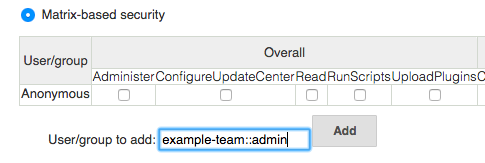

Jenkins Bitbucket OAuth Plugin
============================

Overview
--------
This Jenkins plugin enables [OAuth](https://oauth.net) authentication for [Bitbucket](https://bitbucket.org) users.

Bitbucket Security Realm (authentication):
--------------------------------------------

First you need to get consumer key/secret from Bitbucket.

1. Log into your Bitbucket account.
2. Click on your account avatar in the top right corner and select **Bitbucket Settings**.
3. If your are a member of an organization, ensure you are on Team settings, not Account settings, from the drop down.
4. Under ACCESS MANAGEMENT select **OAuth**.
5. Under OAuth consumers, click **Add consumer**
6. The system requests the following information:
   * **Name** is required.
   * **Callback URL** is required. Input **https://your.jenkins.root/securityRealm/finishLogin** .
   * Others are optional.
7. Under Permissions, select **Account > Read** and **Team membership > Read**(optional).
8. Click Save.
The system generates a key and a secret for you.
Toggle the consumer name to see the generated Key and Secret value for your consumer.

Second, you need to configure your Jenkins.

1. Open Jenkins **Configure System** page.
2. Set correct URL to **Jenkins URL**
3. Click **Save** button.
4. Open Jenkins **Configure Global Security** page.
5. Check **Enable security**.
6. Select **Bitbucket OAuth Plugin** in **Security Realm**.
7. Input your Consumer Key to **Client ID**.
8. Input your Consumer Secret to **Client Secret**.
9. Click **Save** button.

### Bitbucket Team access Support
Based on the teams that user has access to, this plugin automatically creates groups of the form

_team::role_

Supported roles are `owner`, `collaborator` and `member`

Examples
```
team1::owner
team2::collaborator
team3::member
```

These group names can be used in Jenkins *Matrix-based security* to give fine grained access control based on the users team access in Bitbucket.




Via Groovy script
-----------------------------------
```groovy
import hudson.security.AuthorizationStrategy
import hudson.security.SecurityRealm
import jenkins.model.Jenkins
import org.jenkinsci.plugins.BitbucketSecurityRealm
import hudson.util.Secret

// parameters
def bitbucketSecurityRealmParameters = [
  clientID:     '012345678901234567',
  clientSecret: '012345678901234567012345678901'
]

// security realm configuration
SecurityRealm bitbucketSecurityRealm = new BitbucketSecurityRealm(
  bitbucketSecurityRealmParameters.clientID,
  "",
  Secret.fromString(bitbucketSecurityRealmParameters.clientSecret)
)

// authorization strategy - full control when logged in
AuthorizationStrategy authorizationStrategy = new hudson.security.FullControlOnceLoggedInAuthorizationStrategy()

// authorization strategy - set anonymous read to false
authorizationStrategy.setAllowAnonymousRead(false)

// get Jenkins instance
Jenkins jenkins = Jenkins.getInstance()

// add configurations to Jenkins
jenkins.setSecurityRealm(bitbucketSecurityRealm)
jenkins.setAuthorizationStrategy(authorizationStrategy)

// save current Jenkins state to disk
jenkins.save()
```

Changelog
-------
[CHANGELOG](CHANGELOG)

Credits
-------
This plugin reuses many codes of [Jenkins Assembla Auth Plugin](https://wiki.jenkins-ci.org/display/JENKINS/Assembla+Auth+Plugin).
Many thanks to Assembla team.
